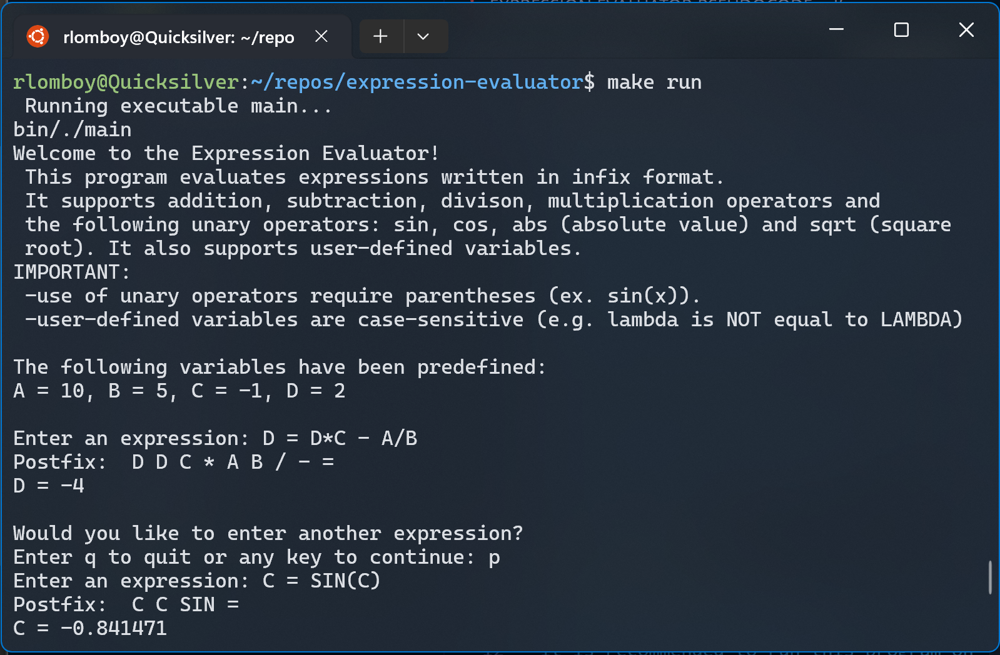
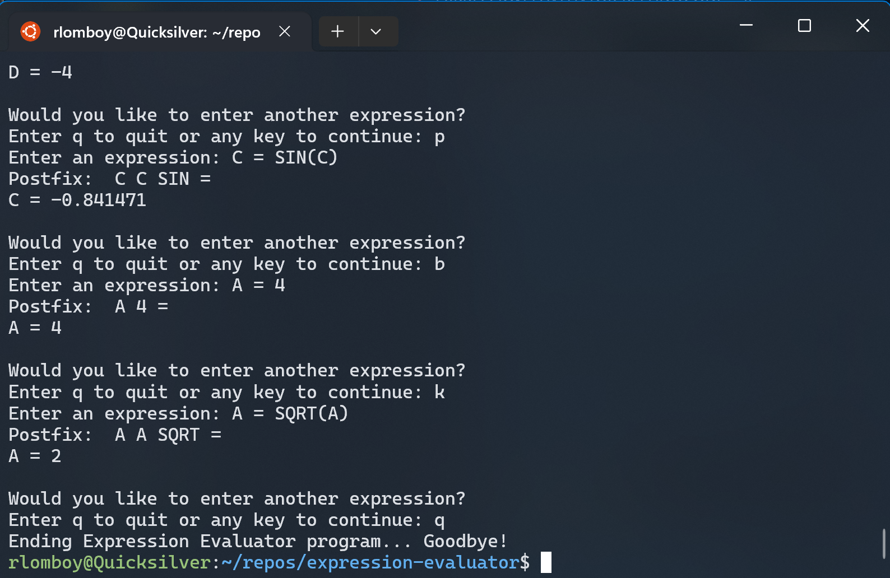

# Expression Evaluator
> This terminal program takes infix expressions, converts them to postfix format then evaluates them. It supports addition, subtraction, division, multiplication operators and sin, cos, absolute value and square root. 

## Description
This program evaluates expressions after converting them from infix to postfix format. It supports addition, subtraction, division, multiplication operators and sin, cos, absolute value and square root. Variables A, B, C and D are used with predefined values. The values of the variables change with assignment as the right hand side of the equation is reduced.

This calculator is implemented with a stack and queue, hashtable, postfix notation and a postfix expression evaluator. 

> Note: Stack, Queue, List, Hashtable and all other classes are custom-made classes by the author. By no means are they more efficient than pre-existing C++ modules, but they served as a learning tool for understand how these data structures work.




For more information on the implementation and goals of this project please navigate to `/docs` to view documentation files.

Fun fact: this program was written over the course of a college semester (about four months excluding syllabus and finals week) and resulted in **20 source code files** **almost 1500 lines of code**.

## Getting Started

### Dependencies
Make sure you have a C++ compiler on your machine. It is recommended to run this program on a *NIX machine with a Bash terminal, such as WSL or Ubuntu.

### Installaton
Clone this repo. Navigate to the expression-evaluator folder to execute make commands.

### Execution
Compile the program by typing the following in the shell:

```sh
make
```
(You will see an output in the terminal of all the build files.)

Run it by typing:
```sh
make run
```

## Usage
After running `make run`, you should see the following in your terminal:


Take note of the instructions:
> IMPORTANT:  
> -use of unary operators require parentheses (ex. sin(x)).  
> -user-defined variables are case-sensitive (e.g. lambda is NOT equal to LAMBDA)  
> The following variables have been predefined: A = 10, B = 5, C = -1, D = 2  

Another example of valid use:



This program allows the user to redefine pre-existing variables. In fact, the only valid expressions assign a variable A, B, C or D to an expression in *infix* format with valid functions. (See message in output.) For example: `D = D*C - A/B` is a valid expression but `SIN(D)` is not.

Variables are stored in a **hashtable** handled by the Evaluator class. For more information about the data structures, class diagrams, Parse Table etc., please refer to the PDFs in `/docs`.

## Version History

* 1.0 
    * The first version (submitted for class assignment).
* 1.1
    * ADD: Add `README.md`

## Meta

Rafaela Lomboy | GitHub: [@rlom721](https://github.com/rlom721)